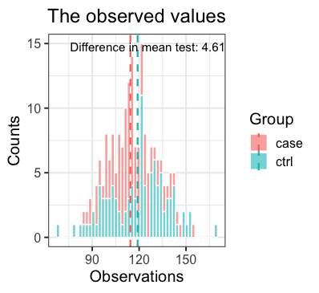
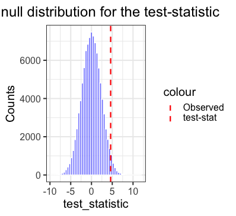

```{r, include = FALSE}
knitr::opts_chunk$set(
  collapse = TRUE,
  comment = "#>"
)
```

```{r setup}
library(PackageProject)
```

## permutation ()

The permutation function provides a way of easily doing a permutation test of significance between observations of two groups. 

The function provides several number of options for the calculation of the test-statistic, where the most used ones (i.e. difference in mean and difference in median) are easily accessible as options to the argument "test_statistic". Further more a user specified function, "my_method()", can be given as argument to the "test_statitic" option as well, making it very flexible. 

Given observations and information about the group, the function returns a list with the method of test-statistic, the observed test-statistic and the permuted p-value. 

If wanted the function returns two plots. 
 
  - One visualizing the raw observations in the two groups together with the wanted test-statistic. 
  - Another visualizing the permuted null-distribution of the test-statistic together with the observed test-statistic. 
  
These two plots helps the user get a better intuition of the permutation output and the resulting p-value. 

## Usage

**Input**

 - `groups`: The column of the dataframe specifying the groups. Must be specified, no default. 
 - `observations`: The column of the dataframe specifying the observations. Must be specified and of equal length as the group column, no default. 
 - `test_statistic`: The method to calculated the test-statistic. Can be one of three options: 
    - `"mean"`: Default. Uses the difference in mean between the two groups to calculate the test-statistic.
    - `"median"`: Uses the difference in median to calculate the test-statistic.
    - `"my_method"`: A user defined function named "my_method()" which takes only one argument, the grouped observations.
 - `nPerm = 10^5`: The number of permutations performed. 
 - `plot = TRUE`: If TRUE the function returns two plots together with the output list. If FALSE only the list (i.e. no plots) will be returned. 

**Output**

A list containing the following: 
  
 - `Plot 1`: The observed values 
 - `Plot 2`: The null distribution for the test-statistic
 - `Method`: The specified method to calculate the test-statistic. Given by the input `test_statistic`
 - `Obs_Test_stat`: The observed test-statistic calculated by method given by the input `test_statistic`
 - `perm_p_value`: The permuted p-value. If equal to 0 a warning will be outputted saying: "Warning: nPerm was to low to get any permuted test statistics equal to or more extreme than your observed". 

## Example

The BloodPressure dataset provided in the package to try out the permutation function, can be fetched to your local environment by running `data(BloodPressure)`.

**Syntax**

```{r eval = F}
permutation(group = BloodPressure$Group, observations = BloodPressure$Blood_pressure, 
            test_statistic = "mean", nPerm = 10^5, plot = TRUE)
```

**Example output**

`$Plot1: The observed values`



`$Plot2: The null distribution for the test-statistic`



`$Method`

`[1] "Difference in mean"`

`$Obs_Test_stat`

`[1] 4.610654`

`$perm_p_value`

`[1] 0.10066`

