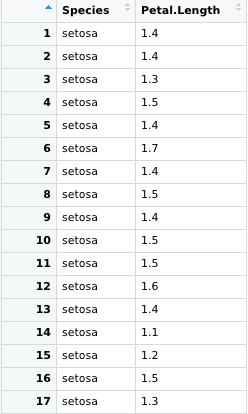

# Permutation part
The user has to provide the data. It has to be a dataframe with one column defining the group and one column with the measured value of an individual in that group. 

The user has to specify the measure of association between the two groups. 
This has to be one of the three options:  
  - Difference in mean
  - Difference in median
  - User defined measure (Note to us: Has to be clearly explained how this has to be defined!!)
  
Output: 
  - Observed test statistic
  - Plot of the permuted null distribution
  - p-value
  
**Example of output**

# Bootstrap part
The user has to provide the data. It has to be a dataframe with at least one column with the observed values. 

**Example of data**

The user has to specify the estimate to be bootstrapped.
This has to be one of the three options: 
  - Mean
  - Median
  - User defined measure (Note to us: Has to be clearly explained how this has to be defined!!)
  
Output: 
  - Standard error and 95 % confidence interval of the specified estimate.
  - Plot of the specifies estimates sampling distribution. 
  
**Example of output**  
