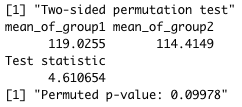
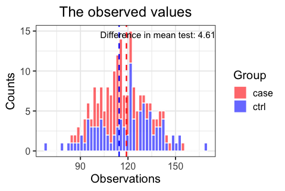
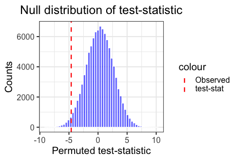
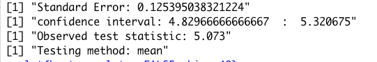
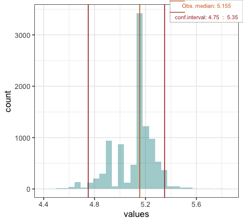

```{r, include = FALSE}
knitr::opts_chunk$set(
  collapse = TRUE,
  comment = "#>"
)
```

```{r, setup}
library(Sampling)
```

# Permutation

The permutation function provides a way of easily doing a permutation test of significance between observations of two groups. 

## Theory behind permutation

A permutation test is a non-parametric test that by resampling provides a way of calculating the p-value as a measure of significance of the difference between two groups. The difference can be measured in multiple ways, most commenly the difference in means between two groups are used. 

The permutation test is done by a series of steps: 

    1. Calculate the observed test-statistic, e.g. the observed difference in means between the two groups.
    
    2. The permutation loop:
        2a. Shuffle all the group labels so they get a new observation. The resampling is done without replacement so the permuted data consist of the same number of observations as the original data, just shuffled. 
        2b. Calculate the permuted test-statistic, e.g. the difference in mean between the two groups in the permuted data. 
        2c. Save the permuted test-statistic in a list and continue the permutation loop, e.g. 10^5 times.
    
    3. After end permutation loop the permuted null distribution of the test-statistic is obtained and the permuted p-value can be calculated like this: 
  
If the observed test-stastistic > 0:
  
$$
p-value = \frac{\sum(\text{permuted test-statistic} >= \text{observed test-statistic})}{\text{# permutations}} \cdot 2
$$
  
If the observed test-statistic < 0: 
  
$$
p-value = \frac{\sum(\text{permuted test-statistic} <= \text{observed test-statistic})}{\text{# permutations}} \cdot 2
$$
  
The p-value is multiplied by 2 to make it a two-sided permutation test (taking both ends of the null distribution into account). 

## The permutation() function
  
The function provides several number of options for the calculation of the test-statistic, where the most used ones (i.e. difference in mean and difference in median) are easily accessible as options to the argument "method". Further more a user specified function, "my_method()", can be given as argument to the "method" argument as well, making it very flexible. 

Given observations and information about the group, the function returns an output.  

The output is of class "permutation" and of class "htest". On these objects both summary() and plot() functions can be called, together with all other functions supplying the "htest" class, e.g. print(). 

The plot() outputs two plots: 
 
  - One visualizing the raw observations in the two groups together with the wanted test-statistic. 
  - Another visualizing the permuted null-distribution of the test-statistic together with the observed test-statistic. 
  
These two plots helps the user get a better intuition of the permutation output and the resulting p-value. 

If the ggplot2 package is a part of the users installed packages, ggplots are made. If not, the plots will be made as base R plots. The user is strongly encouraged to install ggplot2 if not already done to get a better experience.

## Usage

**Input**

 - `groups`: The column of the dataframe specifying the groups. Must be specified, no default. 
 - `observations`: The column of the dataframe specifying the observations. Must be specified and of equal length as the group column, no default. 
 - `method`: The method to calculated the test-statistic. Can be one of three options: 
    - `"mean"`: Default. Uses the difference in mean between the two groups to calculate the test-statistic.
    - `"median"`: Uses the difference in median to calculate the test-statistic.
    - `"my_method"`: A user defined function named "my_method()" which takes only one argument, the grouped observations.
 - `nPerm = 10^5`: The number of permutations performed. 

**Output**

An object of class "permutation" and "htest" containing the following: 

 - `data`: At dataframe with the observed data provided by the user. 
 - `null.value`: A named vector with the test-statistic under the null hypothesis.
 - `alternative`: A character string specifying that it is a "two-sided" test.
 - `Method`: A character string specifying that it is a two-sided permutation test.
 - `estimate`: A named vector with the observed values for each group. 
 - `data.name`: A character string specifying the names of the input given. 
 - `statistic`: A named vector with the observed test-statistic.
 - `parameters`: A named vector with parameters if any. 
 - `perm_statistics`: A list with all the test-statistic values calculated during the permutation. 
 - `p.value`: The permuted p-value as numeric.
 - `Function`: The function used to calculate the test-statistic by the method provided.
 - `Warnings`: A string containing a warning if any (else None).

## Example

The BloodPressure dataset provided in the package to try out the permutation function, can be fetched to your local environment by running `data(BloodPressure)`.

**Syntax**

```{r, eval=FALSE}
perm <- permutation(group = BloodPressure$Group, 
                    observations = BloodPressure$Blood_pressure, 
                    method = "mean", nPerm = 10^5)
```

**Example output**

`summary(perm)`



`plot(perm)`






# Bootstrap

The bootstrap function provides a way of easily doing a bootstrap of a population estimate given observations. The populations estimates found through bootstrap includes SE and confidence intervals. 

## Theory behind Bootstrap
A bootstrap test is a non-parametric test that by resampling provides a way of getting the sampling distribution, by calculating the estimation for each iteration. This makes it possible to get the Standart error of the popultion.

The permutation test is done by a series of steps: 

    1. Calculate the observed estimate, e.g. mean or median.
    
    2. The bootstrap loop:
        2a. randomly pick observation with replacement, so the bootstrapped data consist of the same number of observations as the original data. 
        2b. Calculate the bootstrap estimate, e.g. mean or median. 
        2c. Save the bootstrap estimate in a list and continue the bootstrap loop, e.g. 10^5 times.
    
    3. After end bootstrap loop the bootstraped sampling distribution of the estimate is obtained and the Standart error and confidence interval can be calculated like this: 


Since the standard error is equal to the Stardart deviation of the sampling distribution, we can calculate the SD of the bootstrap with the sd() function from the R stats package.  

Furthermore the confidence interval is found by taking the 0.025 percentile and the 0.975 percentile of the sampling distribution. 

## The Bootstrap() function
The function provides several number of options for the calculation of the bootstrap estimate, where the most used ones (i.e. mean and median) are easily accessible as options to the argument "method". Further more a user specified function, "my_method()", can be given as argument to the "method" argument as well, making it very flexible. 

The output is of class "bootstrap". On this objects both summary() and plot() functions can be called. 

The plot() outputs one plot visualizing the sampling distribution of the population estimate found through bootstrapping, including 95 % confidence intervals and the observed population estimate.  

If the ggplot2 package is a part of the users installed packages, ggplots are made. If not, the plots will be made as base R plots. The user is strongly encouraged to install ggplot2 if not already done to get a better experience.

## Usage

**Input**

 - `observations`: The column of the dataframe specifying the observations. Must be specified and of equal length as the group column, no default. 
 - `method`: The method to calculated the observed population estimate. Can be one of three options: 
    - `"mean"`: Default. The observed population estimate is the mean of all observations. 
    - `"median"`: The observed population estimate is the median of all observations.
    - `"my_method"`: A user defined function named "my_method()" which takes only one argument, the observations and calculates the wanted population estimate. 
 - `nboot = 10^5`: The number of bootstraps performed. 
 
**Output**

An object of class "permutation" and "htest" containing the following: 

 - `SE`: The standard error of the observed population estiamte.
 - `bootstrap_estimates`: A list with all bootstrapped estimates calculated by the method provided by the user. 
 - `conf_intercal`: A character string with the 95 % bootstrap confidence interval of the estimate.
 - `first_conf_limit`: First limit of the 95 % confidence interval.
 - `last_conf_limit`: Last limit of the 95 % confidence interval.
 - `obs_estimate`: The observed population estimate calculated by the method provided by the user. 
 - `Function`: The function used to calculate the estimate by the method provided. 
 - `Warnings`: A string containing warnings if any (else None).

## Example

The PlantGrowth dataset can be used to try out the bootstrap function. 

**Syntax**

```{r, eval = FALSE}
boot <- bootstrap(observations = PlantGrowth$weight, 
                    method = "mean", nboot = 10^5)
```

**Example output**

`summary(boot)`



`plot(boot, bins = 30)`



