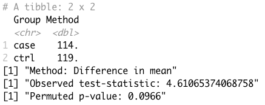
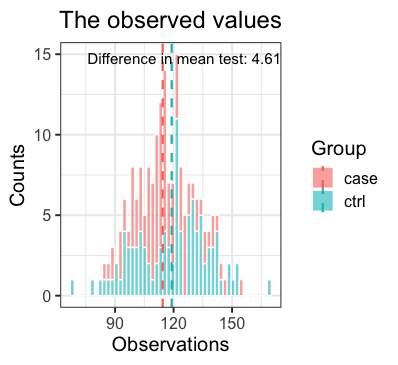
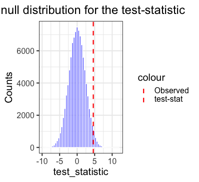

```{r, include = FALSE}
knitr::opts_chunk$set(
  collapse = TRUE,
  comment = "#>"
)
```

```{r setup}
library(PackageProject)
```

## permutation ()

The permutation function provides a way of easily doing a permutation test of significance between observations of two groups. 

The function provides several number of options for the calculation of the test-statistic, where the most used ones (i.e. difference in mean and difference in median) are easily accessible as options to the argument "method". Further more a user specified function, "my_method()", can be given as argument to the "method" argument as well, making it very flexible. 

Given observations and information about the group, the function returns an output.  

The ouput is of class "permutation" and of class "htest". On these objects both summary() and plot() functions can be called, together with all other functions supplying the "htest" class, e.g. print(). 

The plot() outputs two plots: 
 
  - One visualizing the raw observations in the two groups together with the wanted test-statistic. 
  - Another visualizing the permuted null-distribution of the test-statistic together with the observed test-statistic. 
  
These two plots helps the user get a better intuition of the permutation output and the resulting p-value. 

If the ggplot2 package is a part of the users installed packages, ggplots are made. If not, the plots will be made as base R plots. The user is strongly encouraged to install ggplot2 if not already done to get a better experience.

## Usage

**Input**

 - `groups`: The column of the dataframe specifying the groups. Must be specified, no default. 
 - `observations`: The column of the dataframe specifying the observations. Must be specified and of equal length as the group column, no default. 
 - `method`: The method to calculated the test-statistic. Can be one of three options: 
    - `"mean"`: Default. Uses the difference in mean between the two groups to calculate the test-statistic.
    - `"median"`: Uses the difference in median to calculate the test-statistic.
    - `"my_method"`: A user defined function named "my_method()" which takes only one argument, the grouped observations.
 - `nPerm = 10^5`: The number of permutations performed. 

**Output**

An object of class "permutation" and "htest" containing the following: 

 - `data`: At dataframe with the observed data provided by the user. 
 - `null.value`: A named vector with the test-statistic under the null hypothesis.
 - `alternative`: A character string specifying that it is a "two-sided" test.
 - `Method`: A character string specifying that it is a two-sided permutation test.
 - `estimate`: A named vector with the observed values for each group. 
 - `data.name`: A character string specifying the names of the input given. 
 - `statistic`: A named vector with the observed test-statistic.
 - `parameters`: A named vector with parameters if any. 
 - `perm_statistics`: A list with all the test-statistic values calculated during the permutation. 
 - `p.value`: The permuted p-value as numeric.
 - `Function`: The function used to calculate the test-statistic by the method provided.
 - `Warnings`: A string containing a warning if any (else None).

## Example

The BloodPressure dataset provided in the package to try out the permutation function, can be fetched to your local environment by running `data(BloodPressure)`.

**Syntax**

```{r eval = F}
perm <- permutation(group = BloodPressure$Group, observations = BloodPressure$Blood_pressure, 
                    method = "mean", nPerm = 10^5)
```

**Example output**

`summary(perm)`



`plot(perm)`






